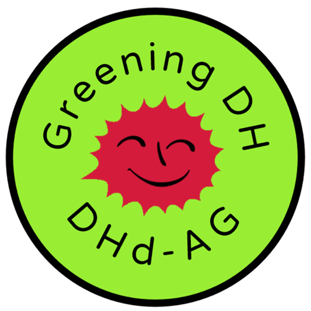

## Kurzvorstellung / Short presentation

Die Arbeitsgruppe »Greening DH« befasst sich mit Fragen, die mit dem ökologischen Fußabdruck von Digital-Humanities-Forschungsaktivitäten zusammenhängen. Es sollen sowohl praktische Aspekte berücksichtigt werden (»greening toolkit«) als auch die epistemologischen Fragen und Herausforderungen, vor welchen die Klimakrise die Community stellt.

*The »Greening DH« task force of the Association for Digital Humanities in the German-speaking countries addresses the environmental footprint of DH research. It contributes to the conception of a DH »greening toolkit« together with sister initiatives around the globe and engages in discussion and research on the epistemological challenges raised by the climate crisis for the DH community.*

## Netzwerk / Network

Greening DH ist eine Arbeitsgruppe des Verbands »Digital Humanities im deutschsprachigen Raum e.V.« (DHd, siehe dazu die [Präsentation der AG auf der DHd-Website](https://dig-hum.de/ag-greening-dh)). Wir arbeiten außerdem in Kooperation und Koordination mit der »Digital Humanities Climate Coalition« ([DHCC](https://www.cdcs.ed.ac.uk/digital-humanities-climate-coalition)).

*Greening DH is a working group of the German Digital Humanities association (DHd, see [presentation of the group at the DHd website](https://dig-hum.de/ag-greening-dh)). We are working in cooperation and coordination with the »Digital Humanities Climate Coalition« ([DHCC](https://www.cdcs.ed.ac.uk/digital-humanities-climate-coalition)).*

## Aktuelles / News

Wir arbeiten dran und halten Euch auf dem Laufenden!

*Soon to be announced, stay tuned!*

## Co-convenors

Anne Baillot, Torsten Roeder

## Mailinglist & Chat

* Discord Server »dhd-greening«: https://discord.gg/APsHmGWU5u
* Mailinglist DHd-AG »Greening DH«: http://lists.digitalhumanities.org/mailman/listinfo/dhd-ag-greening-dh
